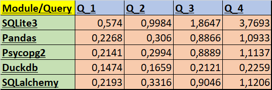
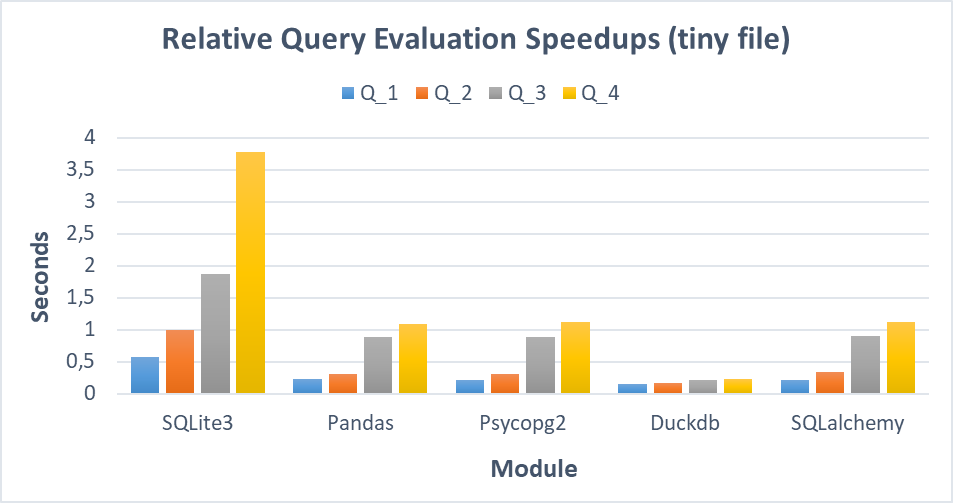
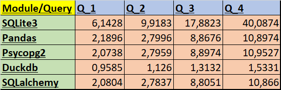

# Benchmark "4 QUERIES"

## Оглавление

- [Оглавление](#оглавление)
- [1. О бенчмарке](#1-о-бенчмарке)
- [2. Запросы](#2-запросы)
- [3. Поговорим о модулях](#3-поговорим-о-модулях)
  - [3.1 Sqlite3](#31-sqlite3)
  - [3.2 Pandas](#32-pandas)
  - [3.3 Psycopg2](#33-psycopg2)
  - [3.4 DuckDB](#34-duckdb)
  - [3.5 SQLAlchemy](#35-sqlalchemy)
- [4. Запуск программы](#4-запуск-программы)
- [5. Реализация](#5-реализация-и-итоги-запусков)
  - [5.1 Организация работы](#51-организация-работы)
  - [5.2 Основной скрипт](#52-основной-скрипт)
  - [5.3 Результаты запусков](#53-результаты-запусков)
  - [5.4 Комментарии к библиотекам](#54-комментарии-к-библиотекам)
- [6. Выводы](#6-выводы)

***

## 1. О бенчмарке

`Бенчмаркинг баз данных` - это проверенный и четко определённый метод анализа и сравнения характеристик производительности баз данных или систем управления базами данных (СУБД). 
**_Основные задачи бенчмарка_:**
* **_<ins>Оценка производительности:</ins>_** помогает оценить скорость работы системы, ПО или компонентов.
* **_<ins>Сравнение систем:</ins>_** позволяет сравнивать производительность разных систем или компонентов в одинаковых условиях.
* **_<ins>Измерение улучшений:</ins>_** позволяет оценить эффективность изменений, таких как обновления программного или аппаратного обеспечения.
* **_<ins>Стандартизированные тесты:</ins>_** предоставляет набор стандартизированных тестов для объективного сравнения производительности.
* **_<ins>Определение базовой производительности:</ins>_** служит отправной точкой для понимания производительности системы и ее способности справляться с задачами.
* **_<ins>Принятие решений:</ins>_** помогает принимать обоснованные решения на основе количественных данных о производительности.

Один из таких бенчмарков носит название `4 QUERIES`. Подробнее с ним можно познакомиться [тут](https://medium.com/m/global-identity-2?redirectUrl=https%3A%2F%2Fmedium.unum.cloud%2Fpandas-cudf-modin-arrow-spark-and-a-billion-taxi-rides-f85973bfafd5). Для реализации этого бенчмарка будем использовать язык программирования `Python`.


Pассмотрим в работе ряд модулей:

* [SQLite3](https://docs.python.org/3/library/sqlite3.html)
* [Pandas](https://pandas.pydata.org/docs/)
* [Psycopg2](https://www.psycopg.org/docs/)
* [Duckdb](https://duckdb.org/docs/)
* [SQLalchemy](https://docs.sqlalchemy.org/en/20/)

## 2. Запросы

```SQL
SELECT "VendorID", COUNT(*) FROM "trips" GROUP BY 1;
```
1. Этот запрос выполняет подсчёт кол-ва записей в таблице `trips` для каждого уникального значения столбца `VendorID` и группирует результаты по типу такси (`VendorID`).

```SQL
SELECT "passenger_count", AVG("total_amount") FROM "trips" GROUP BY 1;
```
2. Этот запрос выполняет вычисление среднего значения стоимости поездки (`total_amount`) для каждого уникального значения числа пассажиров (`passenger_count`) в таблице `trips`.

```SQL
SELECT "passenger_count", EXTRACT(year FROM "tpep_pickup_datetime"), COUNT(*)
FROM "trips" GROUP BY 1, 2;
```
3. Этот запрос извлекает информацию из таблицы `trips` о кол-ве пассажиров (`passenger_count`), годе по времени взятия такси (`tpep_pickup_datetime`), и подсчитывает кол-во записей, соответствующих каждому уникальному значению комбинации числа пассажиров и года взятия такси.

```SQL
SELECT "passenger_count", EXTRACT(year FROM "tpep_pickup_datetime"), ROUND("trip_distance"),
COUNT(*) FROM "trips" GROUP BY 1, 2, 3 ORDER BY 2, 4 DESC;
```
4. Этот запрос извлекает информацию из таблицы trips о кол-ве пассажирор (`passenger_count`), годе по времени взятия такси (`tpep_pickup_datetime`), округлённой дистанции поездки (`trip_distance`) и подсчитывает кол-во записей для каждой уникальной комбинации этих параметров. Результаты сортируются по году взятия такси в порядке возрастания, а кол-во записей в каждой группе упорядочивается по убыванию.

Ссылка на файлы находится [тут](https://drive.google.com/drive/folders/1usY-4CxLIz_8izBB9uAbg-JQEKSkPMg6)

## 3. Поговорим о модулях

### 3.1 SQLite3


**SQLite** – это легковесная реляционная база данных, отличающаяся хорошей производительностью и небольшим размером и являющаяся мощным и гибким инструментом для хранения данных. SQLite является встроенной базой данных в языке `Python`. Использование SQLite в Python имеет мн-во преимуществ:
+ Хранит данные в локальном файле `.db`, что позволяет не зависеть от удаленного сервера баз данных. 
+ Имеет небольшой размер, что упрощает его установку и эксплуатацию. 
+ Поддерживает стандартные для SQL операции, что даёт возможность выполнять любые запросы к базе данных.

Чтобы разобраться в модуле `sqlite3`, необходимого для работы с SQLite, не понадобится много времени. Этот модуль предоставляет целый ряд понятных и удобных функций для работы с базами данных. 
_Основные шаги для работы:_
1. Соединиться с файлом .db
2. Создать курсор
3. Выполнить SQL-запросы для создания/изменения таблиц и получения данных из них
4. Закрыть курсор и соединение с базой данных

```py
import sqlite3
conn = sqlite3.connect("mydatabase.db")
cursor = conn.cursor()
# -----------------------------
cursor.execute("SQL-query")
# -----------------------------
conn.commit()
cursor.close()
conn.close()
```

### 3.2 Pandas


**Pandas** — это программная библиотека на языке `Python`, широко использующаяся для обработки и анализа данных, где работа с ними строится поверх библиотеки `NumPy`. Pandas предоставляет удобные и эффективные инструменты для работы с большими объёмами данных, позволяя легко и гибко манипулировать таблицами, решать задачи фильтрации, сортировки, группировки данных и многое другое. Библиотека `Pandas` разработана с учетом оптимизации производительности. Она позволяет обрабатывать большие объёмы данных с высокой скоростью и эффективно использовать ресурсы процессора и памяти. Основной объект для управления данными — `DataFrame`. Стоит также отметить, что `Pandas` позволяет <ins>работать с различными базами данных</ins> (SQLite, PostgreSQL и др.), выступая при этом дополнительным инструментом (например, для выполнения различных SQL запросов).
> [!NOTE]
> На данный момент библиотека `pandas` является ключевой в анализе данных (Data Mining).

```py
from sqlalchemy import create_engine
import pandas as pd
params = "dialect+driver//username:password@hostname:portnumber/databasename"
engine = create_engine(params)
# -----------------------------
pd.read_sql("SQL query", con=engine)
# -----------------------------
engine.dispose()
```

### 3.3 Psycopg2


**Psycopg2** — это драйвер базы данных `PostgreSQL`, используемый для выполнения операций над PostgreSQL с использованием Python. Psycopg2 является один из самых популярных и стабильных модулей для работы с `PostgreSQL`:
* Используется в большинстве фреймворков Python и Postgres;
* Активно поддерживается и работает как с Python3, так и с Python2;
* Потокобезопасен и спроектирован для работы в многопоточных приложениях. Несколько потоков могут работать с одним подключением.

_Основные шаги для работы:_
1. Соединиться с базой данных в PostrgeSQL + ввести данные в словарь (на коде ниже `params`)
2. Создать курсор
3. Выполнить SQL-запросы для создания/изменения таблиц и получения данных из них
4. Закрыть курсор и соединение с базой данных

```py
import psycopg2 
params = {"dbname": name_database, 
            "user": username, 
            "password": password,
            "host": hostname, 
            "port": portnumber
          } 
conn = psycopg2.connect(**params)  
cursor = conn.cursor() 
# ----------------------------- 
cursor.execute("SQL-query") 
# ----------------------------- 
conn.commit()
cursor.close() 
conn.close() 
```

### 3.4 DuckDB


**DuckDB** — это SQL-встраиваемая `OLAP-система` (online analytical processing) управления базами данных. Кроме того, это реляционная система управления базами данных (СУБД), поддерживающая SQL. DuckDB создана для поддержки рабочих нагрузок аналитических запросов. Это достигается за счёт векторизации выполнения запросов (ориентации на столбцы). Другие СУБД (SQLite, PostgreSQL и др.) обрабатывают каждую строку последовательно. Именно за счёт этого производительность DuckDB увеличивается в разы.
`DuckDB` не имеет внешних зависимостей и серверного программного обеспечения, которое нужно устанавливать, обновлять и поддерживать. Это полностью встроенная система, что обеспечивает дополнительное преимущество — быструю передачу данных в базу данных и из неё.

```py
import duckdb
conn = duckdb.connect("mydatabase.duckdb")
cursor = conn.cursor()
# -----------------------------
cursor.execute("SQL-query")
# -----------------------------
cursor.close()
conn.close()
```

### 3.5 SQLAlchemy


**SQLAlchemy** — это Python-библиотека, которая позволяет работать с реляционными базами данных с помощью `ORM`. Самая важная особенность SQLAlchemy — это ее **_ORM_**. ORM или _Object Relational Mapper_ (объектно-реляционное отображение) позволяет работать с базой данных с помощью объектно-ориентированного кода, не используя SQL-запросы. Еще одна особенность SQLAlchemy заключается в том, что код приложения будет оставаться тем же вне зависимости от используемой базы данных. Так, SQLAlchemy позволяет работать с базами данных MySQL, PostgreSQL, SQLite и другими.
Тем не менее, в SQLAlchemy также `можно пользоваться SQL-запросами`, если кто-то привык к ним:
```py
import sqlalchemy
from sqlalchemy.orm import sessionmaker
params = "dialect+driver//username:password@hostname:portnumber/databasename"
engine = sqlalchemy.create_engine(params)
session = sessionmaker(bind=engine)()
# -----------------------------
session.execute(sqlalchemy.text("SQL-query"))
# -----------------------------
session.close()
engine.dispose()
```

## 4. Запуск программы

1. Предварительно необходимо установить все библиотеки. Для этого напишите в терминале строку
`pip install -r requirements.txt`. После установки можете проверить наличие всех модулей через команду `pip list` также в терминале.
> [!NOTE]
> Модуль `sqlite3` включён в стандартную библиотеку Python и его не нужно скачивать.
2. После клонирования репозитория создайте папку, где будут храниться файлы `.сsv`, `.db`;  
3. Скачайте файлы `nyc_yellow_tiny.csv`, `nyc_yellow_big.csv` (можно один, можно оба) и поместите их в папку, созданную в предыдущем пункте; 
> [!NOTE]
> В исходных файлах содержатся несколько некорректные данные. Два последних столбца имеют одинаковое название и различаются только в регистре, причём последний столбец `Airport_fee` не имеет никаких данных. Это приводит к ошибке дубликатов при создании файла `.db`. Для решения проблемы последний столбец удалён;
4. Для настройки запуска программы откройте файл `config.py` и поправьте нужные Вам данные (кол-во испытаний, названия таблиц, файлов с данными, ваши данные для подключения к `PostgreSQL`, а также выполняемые модули); Флаг `DROP` означает, нужно ли удалить текущую таблицу и загрузить новую вместо неё. Это действие будет выполнено при положении `True`.
5. Чтобы выполнить код, откройте файл `main.py` и запустите его;
> [!IMPORTANT]
> Если есть желание проверить оба файла `.csv`, то не забудьте поменять название файла и таблицы, прежде чем запустить программу заново.

#### Скрипт Config.py

```py
# Кол-во попыток запуска на статистических данных
ATTEMPTS = 20

# Название таблицы в базе данных
name_tb = ""
DROP = False
# Название файла с данными (с расширением .csv)
data = ""
# Название папки, где будут храниться файлы .csv, .db
folder_data = ""

# Данные для подключения к PostrgeSQL
username = ""
password = ""
hostname = ""
port = ""
name_database = ""

# Выполняемые модули в программе (True, False)
SQLITE3 = False
PANDAS = False
PSYCOPG2 = False
DUCKDB = False
SQLALCHEMY = False
```

## 5. Реализация

### 5.1 Организация работы

Вся работа разбита на ряд файлов `.py`. Под каждую библиотеку заведён отдельный файл `.py` (`test_duck_db.py`, `test_pandas.py`, `test_psycopg2.py`, `test_sqlalchemy.py`, `test-sqlite3.py`). Внутри каждого такого файла выполняется аналогичная работа, соответствующая синтаксису данного модуля:
* Осуществляется подключение к базе данных;
* Выполняется выставляемое число испытаний для нахождения впоследствии среднего значения времени; Для этого использовалась функция `perf_counter` из модуля `time`;
* Осуществляется отключение от базы данных;
* В результате выполнения функции `(module).test()` возвращается объект типа `<class 'list'>` из 4-х элементов, где каждый i-й элемент соответствует результату выполнения i-го запроса;

Все вышеупомянутые файлы используют уже существующие базы данных, которые создаются в результате выполнения кода в файле `functions.py`. Внутри этого модуля определена функция `load_data`, внутри которой осуществляется подключение к PostgreSQL и SQLite и последующее создание таблиц внутри них с помощью модуля `pandas` и функции `to_sql`. Предварительно вся информация считывается из файла `.csv` через функцию `read_csv`. При первом запуске программы создаются все необходимые таблицы, которые были указаны в конфигурационном файле `config.py`. При последующем запуске программы эти таблицы заново не пересоздаются, на что выводится соответствующее сообщение. 

> [!NOTE]
> `psycopg2`, `pandas` и `sqlalchemy` в данной работе были подключены к PostgreSQL, в то время как `duckdb` и `sqlite3` — к SQLite. Для работы `duckdb` с SQLite в программе прописана специальная строка:
```py
duckdb.install_extension("sqlite")
```

### 5.2 Основной скрипт

```py
from src import test_sqlite3 as T_sqlite3
from src import test_pandas as T_pandas
from src import test_psycopg2 as T_psycopg2
from src import test_duck_db as T_duckdb
from src import test_sqlalchemy as T_sqlalchemy
from src import functions as Func

tests = [T_sqlite3.test, T_pandas.test, T_psycopg2.test, T_duckdb.test, T_sqlalchemy.test]
Func.load_data()
Func.run_queries(tests)
```

Основной скрипт `main.py` содержит всю информацию, необходимую для запуска, а также вызывает внутри себя функции из `load_data` и `run_queries` из модуля `functions.py`. Для использования функций `(module).test()` был заведён список ссылок на функции `tests`, который впоследствии передаётся функции `run_queries`. Эта функция соединяет в себе флажки, выставляемые в файле `config.py`, а также переданный список ссылок на функции. В результате выполнения все итоги тестов записываются в файл `results.csv` с помощью объекта `DataFrame`. Тестирование одного запроса проводилось **20 раз** (см. запросы [тут](#2-запросы)). После этого в `Excel` были построены графики для полученных результатов.

### 5.3 Результаты запусков

* Результаты работы на файле размером ~200МБ (`nyc_yellow_tiny.csv`):



* Сравнение времени работы (в секундах) на разных модулях в виде графика: 



* Результаты работы на файле размером ~2ГБ (`nyc_yellow_big.csv`):



* Сравнение времени работы (в секундах) на разных модулях в виде графика: 


### 5.4 Комментарии к библиотекам

#### DuckDB

Самой быстрой среди всех библиотек оказался модуль `duckdb`, опережая другие библиотеки в несколько раз. Он имеет широкий спектр функций, позволяющих без лишних проблем управлять данными. Изучая документацию по этому модулю, могу выделить ещё в качестве "+" встроенный способ загрузки информации через csv файл с помощью выполнения запроса ниже. Этот модуль показался мне достаточно лёгким в понимании и удобным. По итогу краткого знакомства можно сделать вывод, что Duckdb следует применять для интерактивного анализа данных и “граничных” вычислений вследствие своей высокой производительности при работе с большими объёмами данных.
```SQL
CREATE TABLE table_name AS SELECT * FROM `example.csv`;
```

#### Pandas

На мой взгляд, `pandas` является одним из _самых удобных инструментов_ для работы с данными. Обладая целом набором полезных и интуитивно понятных функций, pandas позволяет эффективно проделывать с данными самые разные операции. В данной работе pandas участвовал в первую очередь для чтения файлов .csv и последующей записи объектов DataFrame в базы данных через функцию `to_sql`. Он позволяет не только читать SQL-запросы напрямую (через `read_sql`), что несомненно удобно, но и выполнять запросы через встроенные функции, используя объекты `DataFrame`. По скорости pandas уступает лишь duckdb и находится наравне с psycopg2, так в работе был подключён к PostgreSQL. Больших же дополнительных накладок на выполнение запросов он не создаёт.

#### SQLite3

Могу сказать, что `SQLite3` — весьма лёгкая в использовании, встроенная библиотека Python. База данных SQLite, применимая к этому модулю, автономна, _не требует отдельного сервера_ и хранит всю информацию локально, в отдельном файле `.db`, что и "+", и "-" одновременно. Проверяя для каждой библиотеки возможность автоматического заполнения данных из `.csv`, я, к сожалению, не нашёл в sqlite3 такой фукнции. По поводу производительности — данная библиотека показала самый плохой результат, отставая от других в разы (40 секунд по сравнению с 1,5 секундами, например), однако это время могло бы быть улучшено с помощью различных способов оптимизации. Несмотря на ограничения, SQLite в большей части применяется _в работе с мобильными приложениями_, а также когда нет необходимости использовать более тяжелые ресурсы, такие как PostgreSQL и др.

#### Psycopg2

Говоря о `Psycopg2`, можно сказать, что это весьма популярная библиотека для работы с PostgreSQL, позволяющая легко и быстро выполнять различные действия прямо в Python. Тем, кому нравится PostgreSQL, понравится и этот модуль. Он имеет различные функции для таких действий как: создание и выполнение SQL-запросов, чтение и запись данных в таблицы. Помимо этого, поддерживает транзакции и загрузку данных из `csv-файла`. При этом, загрузка в Postgres происходит достаточно долго по сравнению с работой SQLite и файлом `.db`. По скорости же работы эта библиотека идёт после duckDB. Так, на производительности может сказываться система транзакций, требующих подтверждения. Тем не менее, PostgreSQL — это оптимизированная СУБД => замеренное время может быть улучшено.

#### SQLAlchemy

Одной из главных отличий `SQLAlchemy` от других СУБД является то, что она позволяет работать с реляционными базами данных с помощью _ORM_. ORM позволяет управлять базами данных с помощью методов объектов в коде и при этом не использовать SQL-запросы. В данном бенчмарке этот модуль был самым нелогичным из-за этой особенности, так как написание классов, как отдельных таблиц, вовсе не требовалось. Тем не менее, SQLAlchemy находит применение в различных веб-фреймворках (TurboGears, Pylons, Pyramid, Zope). По производительности эта библиотека держится наравне с psycopg2 и pandas, так как все они были подключены к PostgreSQL. Больших же дополнительных накладок на выполнение запросов SQLALchemy не создаёт.

***

## 6. Выводы


Таким образом, в работе был написан бенчмарк для тестирования 5 модулей `Python` для взаимодействия с базами данных. Больше всего среди них отличилась библиотека **duckdb**, имеющая самую лучшую производительность. Это объясняется тем, что DuckDB специально создана для поддержки рабочих нагрузок аналитических запросов, охватывающих большой объём данных. Второе место заняла библиотека **psycopg2** с базой данных PostgreSQL, проигрывая DuckDB в несколько раз. Это связано с тем, что PostgreSQL, из-за своей реляционной структуры базы данных, начинает обработку с первой строки и просматривает всю таблицу для нахождения нужных данных. Это делает работу медленнее, особенно при обработке больших объёмов данных. Тем не менее, PostgreSQL сама по себе является сравнительно оптимизированной СУБД и вследствие чего занимает достаточно высокую позицию в оценке производительности. Несмотря на свою простоту в использовании, самый худший результат показала библиотека **sqlite3** при работе с SQLite из-за неоптимизированной работы с большими объёмами данных. Один из способов улучшения производительности заключается в _индексации столбцов_, упоминаемых в запросах. Остальные библиотеки (**pandas** и **sqlalchemy**), обладая большим кол-вом инструментов и возможностей, были подключены в ходе работы к PostgreSQL, из-за чего запросы были выполнены примерно за одинаковое время, схожее с результатами модуля `psycopg2`. Подводя итог, хочется сказать, что данная работа познакомила меня с огромными возможностями управления базами данных, используя язык программирования `Python`. При этом выбор той или иной библиотеки зависит от условий разработки и поставленных целей в проекте.
