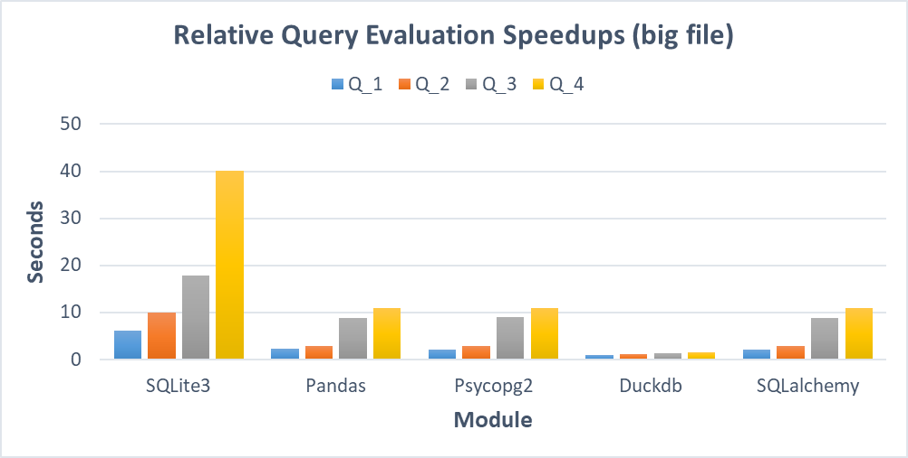

# Benchmark "4 QUERIES"

## Оглавление

- [Оглавление](#оглавление)
- [1 О бенчмарке](#1-о-бенчмарке)
- [2 Запросы](#2-запросы)
- [3 Поговорим о модулях](#3-поговорим-о-модулях)
  - [3.1 Sqlite3](#31-sqlite3)
  - [3.2 Pandas](#32-pandas)
  - [3.3 Psycopg2](#33-psycopg2)
  - [3.4 Duckdb](#34-duckdb)
  - [3.5 SQLAlchemy](#35-sqlalchemy)
- [4 Запуск программы](#4-запуск-программы)
- [5 Итоги запусков и визуализация](#5-итоги-запусков-и-визуализация)
- [6 Выводы](#6-выводы)
- [Заключение](#заключение)

***

## 1 О бенчмарке

`Бенчмаркинг баз данных` - это проверенный и четко определённый метод анализа и сравнения характеристик производительности баз данных или систем управления базами данных (СУБД). 
**_Основные задачи бенчмарка_**
* **_<ins>Оценка производительности:</ins>_** помогает оценить скорость работы системы, ПО или компонентов.
* **_<ins>Сравнение систем:</ins>_** позволяет сравнивать производительность разных систем или компонентов в одинаковых условиях.
* **_<ins>Измерение улучшений:</ins>_** позволяет оценить эффективность изменений, таких как обновления программного или аппаратного обеспечения.
* **_<ins>Стандартизированные тесты:</ins>_** предоставляет набор стандартизированных тестов для объективного сравнения производительности.
* **_<ins>Определение базовой производительности:</ins>_** служит отправной точкой для понимания производительности системы и ее способности справляться с задачами.
* **_<ins>Принятие решений:</ins>_** помогает принимать обоснованные решения на основе количественных данных о производительности.

Один из таких бенчмарков носит название `4 QUERIES`. Подробнее с ним можно познакомиться [тут](https://medium.com/m/global-identity-2?redirectUrl=https%3A%2F%2Fmedium.unum.cloud%2Fpandas-cudf-modin-arrow-spark-and-a-billion-taxi-rides-f85973bfafd5). Для реализации этого бенчмарка будем использовать язык программирования `Python`.


Pассмотрим в работе ряд модулей (предварительно необходимо их скачать через `pip install` в терминале):
* [SQLite3](https://docs.python.org/3/library/sqlite3.html)
* [Pandas](https://pandas.pydata.org/docs/)
* [Psycopg2](https://www.psycopg.org/docs/)
* [Duckdb](https://duckdb.org/docs/)
* [SQLalchemy](https://docs.sqlalchemy.org/en/20/)

## 2 Запросы

```SQL
SELECT "VendorID", COUNT(*) FROM "trips" GROUP BY 1;
```
1. Этот запрос выполняет подсчёт кол-ва записей в таблице `trips` для каждого уникального значения столбца `VendorID` и группирует результаты по типу такси (`VendorID`).

```SQL
SELECT "passenger_count", AVG("total_amount") FROM "trips" GROUP BY 1;
```
2. Этот запрос выполняет вычисление среднего значения стоимости поездки (`total_amount`) для каждого уникального значения числа пассажиров (`passenger_count`) в таблице `trips`.

```SQL
SELECT "passenger_count", EXTRACT(year FROM "tpep_pickup_datetime"), COUNT(*)
FROM "trips" GROUP BY 1, 2;
```
3. Этот запрос извлекает информацию из таблицы trips о кол-ве пассажиров (`passenger_count`), годе по времени взятия такси (`tpep_pickup_datetime`), и подсчитывает кол-во записей, соответствующих каждому уникальному значению комбинации числа пассажиров и года взятия такси.

```SQL
SELECT "passenger_count", EXTRACT(year FROM "tpep_pickup_datetime"), ROUND("trip_distance"),
COUNT(*) FROM "trips" GROUP BY 1, 2, 3 ORDER BY 2, 4 DESC;
```
4. Этот запрос извлекает информацию из таблицы trips о кол-ве пассажирор (`passenger_count`), годе по времени взятия такси (`tpep_pickup_datetime`), округлённой дистанции поездки (`trip_distance`) и подсчитывает кол-во записей для каждой уникальной комбинации этих параметров. Результаты сортируются по году взятия такси в порядке возрастания, а кол-во записей в каждой группе упорядочивается по убыванию.

Ссылка на файлы находится [тут](https://drive.google.com/drive/folders/1usY-4CxLIz_8izBB9uAbg-JQEKSkPMg6)

## 3 Поговорим о модулях

### 3.1 SQLite3


**SQLite** – это легковесная реляционная база данных, отличающаяся высокой производительностью и небольшим размером и являющаяся мощным и гибким инструментом для хранения данных. SQLite является встроенной базой данных в языке `Python`. Использование SQLite в Python имеет мн-во преимуществ:
+ Хранит данные в локальном файле .db, что позволяет не зависеть от удаленного сервера баз данных. 
+ Имеет небольшой размер, что упрощает его установку и эксплуатацию. 
+ Поддерживает стандартные для SQL операции, что даёт возможность выполнять любые запросы к базе данных.

Чтобы разобраться в модуле `sqlite3`, не понадобится много времени. Этот модуль предоставляет целый ряд понятных и удобных функций для работы с базами данных. 
_Основные шаги для работы:_
1. Соединиться с файлом .db
2. Создать курсор
3. Выполнить SQL-запросы для создания/изменения таблиц и получения данных из них
4. Закрыть курсор и соединение с базой данных

```py
import sqlite3
conn = sqlite3.connect("mydatabase.db")
cursor = conn.cursor()
# -----------------------------
cursor.execute("SQL-query")
# -----------------------------
conn.commit()
cursor.close()
conn.close()
```

### 3.2 Pandas


**Pandas** — это программная библиотека на языке `Python` для обработки и анализа данных, где работа с ними строится поверх библиотеки `NumPy`. Pandas предоставляет удобные и эффективные инструменты для работы с большими объёмами данных, позволяя легко и гибко манипулировать таблицами, решать задачи фильтрации, сортировки, группировки данных и многое другое. Библиотека `Pandas` разработана с учетом оптимизации производительности. Она позволяет обрабатывать большие объёмы данных с высокой скоростью и эффективно использовать ресурсы процессора и памяти.
> [!NOTE]
> Стоит также отметить, что `pandas` позволяет <ins>подключаться к различным базам данным</ins>, выступая при этом дополнительным инструментом, некоторой обёрткой, если так можно сказать (например, для выполнения различных SQL запросов).

```py
from sqlalchemy import create_engine
import pandas as pd
engine = create_engine("dialect+driver//username:password@hostname:portnumber/databasename")
# -----------------------------
pd.read_sql("SQL query", con=engine)
# -----------------------------
engine.dispose()
```

### 3.3 Psycopg2


**Psycopg2** — это драйвер базы данных `PostgreSQL`, используемый для выполнения операций над PostgreSQL с использованием Python. Psycopg2 является один из самых популярных и стабильных модулей для работы с `PostgreSQL`:
* Используется в большинстве фреймворков Python и Postgres;
* Активно поддерживается и работает как с Python3, так и с Python2;
* Потокобезопасен и спроектирован для работы в многопоточных приложениях. Несколько потоков могут работать с одним подключением.

_Основные шаги для работы:_
1. Соединиться с базой данных в PostrgeSQL
2. Создать курсор
3. Выполнить SQL-запросы для создания/изменения таблиц и получения данных из них
4. Закрыть курсор и соединение с базой данных

```py
import psycopg2 
db_params = {"dbname": name_database, 
            "user": username, 
            "password": password,
            "host": hostname, 
            "port": portnumber
            } 
conn = psycopg2.connect(**params)  
conn.autocommit = True
cursor = conn.cursor() 
# ----------------------------- 
cursor.execute(sql) 
# ----------------------------- 
conn.commit()
cursor.close() 
conn.close() 
```

### 3.4 Duckdb


**DuckDB** — это SQL-встраиваемая `OLAP-система` (online analytical processing) управления базами данных. Кроме того, это реляционная система управления базами данных (СУБД), поддерживающая SQL. DuckDB создана для поддержки рабочих нагрузок аналитических запросов. Это достигается за счёт векторизации выполнения запросов (ориентации на столбцы). Другие СУБД (SQLite, PostgreSQL и др.) обрабатывают каждую строку последовательно. Именно за счёт этого производительность DuckDB увеличивается в разы.
`DuckDB` не имеет внешних зависимостей и серверного программного обеспечения, которое нужно устанавливать, обновлять и поддерживать. Это полностью встроенная система, что обеспечивает дополнительное преимущество — быструю передачу данных в базу данных и из неё.

```py
import duckdb
conn = duckdb.connect("mydatabase.duckdb")
cursor = conn.cursor()
# -----------------------------
cursor.execute("SQL-query")
# -----------------------------
cursor.close()
conn.close()
```

### 3.5 SQLAlchemy


**SQLAlchemy** — это Python-библиотека, которая позволяет работать с реляционными базами данных с помощью `ORM`. Самая важная особенность SQLAlchemy — это ее **_ORM_**. ORM или _Object Relational Mapper_ (объектно-реляционное отображение) позволяет работать с базой данных с помощью объектно-ориентированного кода, не используя SQL-запросы. Еще одна особенность SQLAlchemy заключается в том, что код приложения будет оставаться тем же вне зависимости от используемой базы данных. Так, SQLAlchemy позволяет работать с базами данных MySQL, MS-SQL, PostgreSQL, SQLite и другими.

Тем не менее, в SQLAlchemy также можно пользоваться SQL-запросами, если кто-то привык к ним:
```py
import sqlalchemy
engine = sqlalchemy.create_engine("dialect+driver//username:password@hostname:portnumber/databasename")
connection = engine.connect()
# -----------------------------
connection.execute(sqlalchemy.text("SQL-query"))
# -----------------------------
connection.close()
engine.dispose()
```

## 4 Запуск программы
 
1. После клонирования репозитория создайте папку, где будут храниться файлы `.сsv` и `.db`;  
2. Скачайте файлы `nyc_yellow_tiny.csv`, `nyc_yellow_big.csv` (можно один, можно оба) и поместите их в папку, созданную в предыдущем пункте; 
> [!NOTE]
> В исходных файлах содержатся несколько некорректные данные. Два последних столбца имеют одинаковое название и различаются только в регистре, причём последний столбец `Airport_fee` не имеет никаких данных. Это приводит к ошибке дубликатов при создании файла `.db`. Для решения проблемы удалите последний столбец в самом файле (`Airport_fee`);
3. Для настройки запуска программы откройте файл `config.py` и поправьте нужные Вам данные (кол-во попыток, названия баз данных, таблиц, файлов с данными, ваши данные для подключения к `PostgreSQL`, а также выполняемые модули);
4. Чтобы выполнить код, откройте файл `main.py` и запустите его;

## 5 Итоги запусков и визуализация 

* Результаты работы на файле размером ~200МБ (`nyc_yellow_tiny.csv`):


* Сравнение времени работы (в секундах) на разных модулях в виде графика: 


* Результаты работы на файле размером ~2ГБ (`nyc_yellow_big.csv`):


* Сравнение времени работы (в секундах) на разных модулях в виде графика: 



***

## 6 Выводы

-

## Заключение

-
